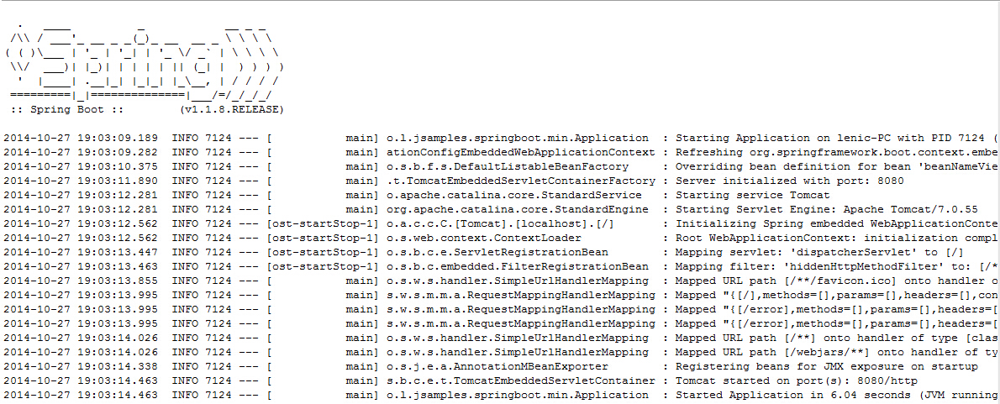
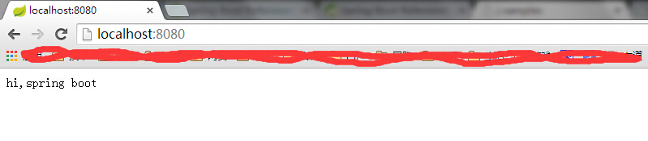
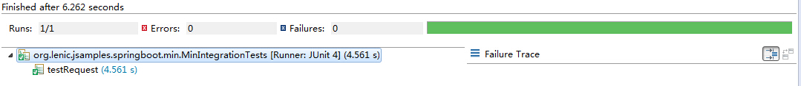
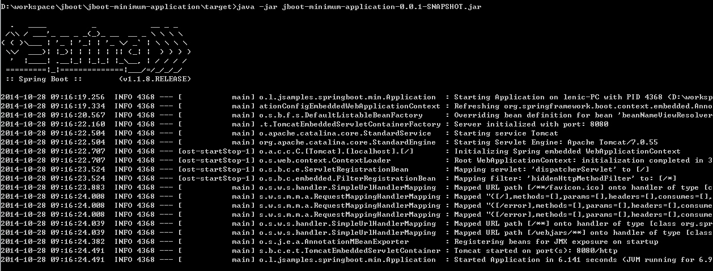

#最简单的spring-boot应用

本文演示了如何创建一个spring-boot应用，包括项目依赖、Rest服务、单元测试、打包部署。
*  继承`spring-boot-starter-parent`项目
```
	<parent>
		<groupId>org.springframework.boot</groupId>
		<artifactId>spring-boot-starter-parent</artifactId>
		<version>1.1.8.RELEASE</version>
	</parent>
```

*  在pom.xml中添加依赖
```
<dependencies>
	<dependency>
		<groupId>org.springframework.boot</groupId>
		<artifactId>spring-boot-starter-web</artifactId>
	</dependency>
	<dependency>
		<groupId>org.springframework.boot</groupId>
		<artifactId>spring-boot-starter-test</artifactId>
	</dependency>
</dependencies>
```

*  创建Application类
```
@Configuration
@ComponentScan
@EnableAutoConfiguration
@Controller
public class Application {

	@RequestMapping("/")
	public @ResponseBody String greetings() {
		return "hi,spring boot";
	}

	public static void main(String[] args) {
		SpringApplication.run(Application.class, args);
	}
}
```

*  运行程序



*  浏览器访问



*  编写单元测试
```
@RunWith(SpringJUnit4ClassRunner.class)
@SpringApplicationConfiguration(classes = Application.class)
@WebAppConfiguration
@IntegrationTest
public class MinIntegrationTests {
	RestTemplate	template	= new TestRestTemplate();

	@Test
	public void testRequest() throws Exception {
		ResponseEntity<String> response = template.getForEntity("http://localhost:8080", String.class);
		assertEquals(response.getStatusCode().value(), 200);
		assertEquals(response.getBody(), "hi,spring boot");
	}
}
```

*  运行单元测试



*  打包与发布
  *  在pom.xml中添加plugin
  ```
	<build>
		<plugins>
			<plugin>
				<groupId>org.springframework.boot</groupId>
				<artifactId>spring-boot-maven-plugin</artifactId>
			</plugin>
		</plugins>
	</build>
  ```
  
  *  执行mvn clean install，打包过程会看见下面日志，
  ```
  [INFO] --- spring-boot-maven-plugin:1.1.8.RELEASE:repackage (default) @ jboot-minimum-application ---
  ```
  
  *  打包结束会有jboot-minimum-application-0.0.1-SNAPSHOT.jar和jboot-minimum-application-0.0.1-SNAPSHOT.jar.original两个文件，前者就是executable jar
  ```
  java -jar jboot-minimum-application-0.0.1-SNAPSHOT.jar
  ```


