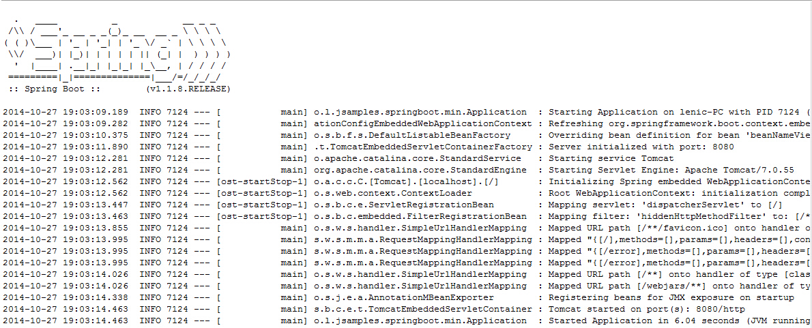
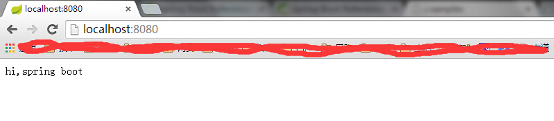
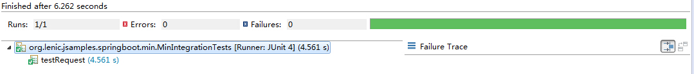

#最简单的spring-boot应用

本文演示了如何创建一个spring-boot应用，并进行集成测试。

*  在pom.xml中添加依赖
```
<dependencyManagement>
	<dependencies>
		<dependency>
			<groupId>org.springframework.boot</groupId>
			<artifactId>spring-boot-dependencies</artifactId>
			<version>1.1.8.RELEASE</version>
			<type>pom</type>
			<scope>import</scope>
		</dependency>
	</dependencies>
</dependencyManagement>
<dependencies>
	<dependency>
		<groupId>org.springframework.boot</groupId>
		<artifactId>spring-boot-starter-web</artifactId>
	</dependency>
	<dependency>
		<groupId>org.springframework.boot</groupId>
		<artifactId>spring-boot-starter-test</artifactId>
	</dependency>
</dependencies>
```

*  创建Application类
```
@Configuration
@ComponentScan
@EnableAutoConfiguration
@Controller
public class Application {

	@RequestMapping("/")
	public @ResponseBody String greetings() {
		return "hi,spring boot";
	}

	public static void main(String[] args) {
		SpringApplication.run(Application.class, args);
	}
}
```

*  运行程序



*  浏览器访问



*  编写单元测试
```
@RunWith(SpringJUnit4ClassRunner.class)
@SpringApplicationConfiguration(classes = Application.class)
@WebAppConfiguration
@IntegrationTest
public class MinIntegrationTests {
	RestTemplate	template	= new TestRestTemplate();

	@Test
	public void testRequest() throws Exception {
		ResponseEntity<String> response = template.getForEntity("http://localhost:8080", String.class);
		assertEquals(response.getStatusCode().value(), 200);
		assertEquals(response.getBody(), "hi,spring boot");
	}
}
```

*  运行单元测试

