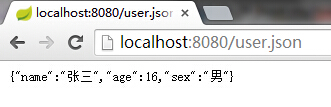
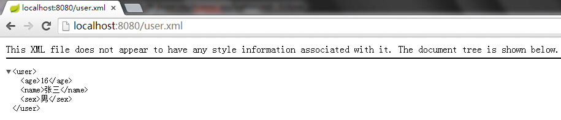
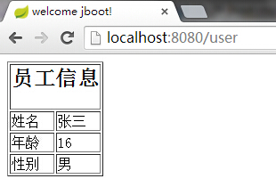
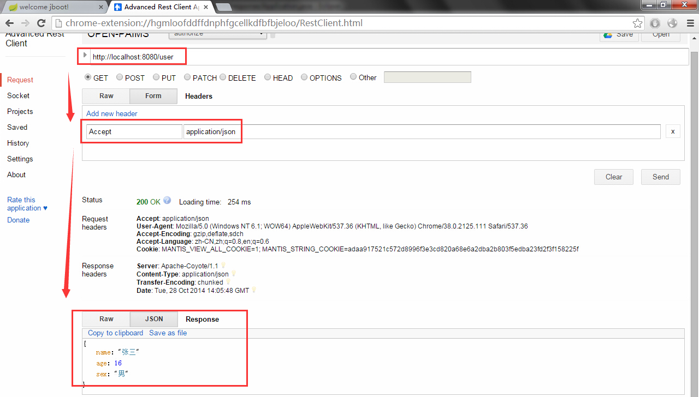
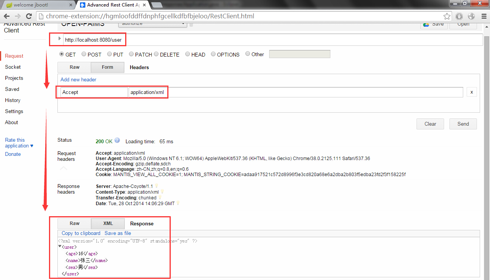
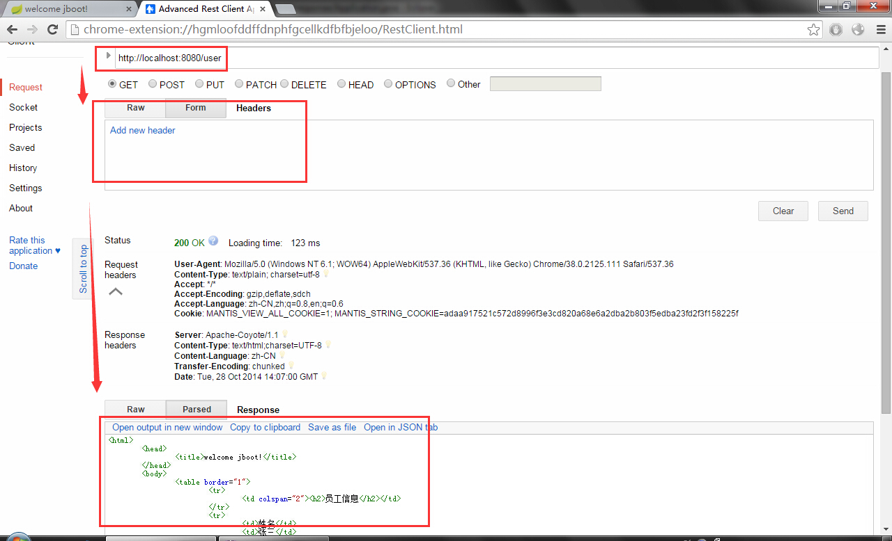

#使用spring-boot构建多视图SpringMVC应用

本文演示了使用spring-boot构建多视图的SpringMVC应用，包括JSON、XML、freemarker三种输出。

*  像之前的例子一样先创建Application类，并定义一个`/user`的rest服务

```
@Configuration
@ComponentScan
@EnableAutoConfiguration
@Controller
public class Application {
	@RequestMapping("/user")
	public @ResponseBody User findUser() {
		return new User("张三", 16, "男");
	}
	public static void main(String[] args) {
		SpringApplication.run(Application.class, args);
	}
}
```

*  启动程序访问`http://localhost:8080/user`就可以看到json格式的输出了

*  为了使`/user`支持freemarker视图，让`Application`继承`WebMvcConfigurerAdapter`，启用注解`@EnableWebMvc`，并复写`configureContentNegotiation(ContentNegotiationConfigurer configurer)`方法

```
@Configuration
@ComponentScan
@EnableAutoConfiguration
@Controller
@EnableWebMvc
public class Application extends WebMvcConfigurerAdapter {
	@RequestMapping(value = "/user", produces = { "application/json" })
	public @ResponseBody User findUser() {
		return new User("张三", 16, "男");
	}
	@RequestMapping(value = "/user", produces = { "text/html" })
	public ModelAndView viewUser() {
		return new ModelAndView("user", "user", findUser());
	}
	@Override
	public void configureContentNegotiation(ContentNegotiationConfigurer configurer) {
		configurer.favorPathExtension(true);
		configurer.ignoreAcceptHeader(true);
		configurer.useJaf(false);
		configurer.defaultContentType(MediaType.TEXT_HTML);
		configurer.mediaType("html", MediaType.TEXT_HTML);
		configurer.mediaType("json", MediaType.APPLICATION_JSON);
	}
	public static void main(String[] args) {
		SpringApplication.run(Application.class, args);
	}
}
```

*  在`src/main/resources`中添加`/templates/user.ftl`文件，内容如下

```
<html> 
	<head> 
		<title>welcome jboot!</title> 
	</head> 
	<body>
		<table border="1">
			<tr>
				<td colspan="2"><h2>员工信息</h2></td>
			</tr>
			<tr>
				<td>姓名</td>
				<td>${user.name}</td>
			</tr>
			<tr>
				<td>年龄</td>
				<td>${user.age}</td>
			</tr>
			<tr>
				<td>性别</td>
				<td>${user.sex}</td>
			</tr>
		</table>
	</body> 
</html> 
```

*  上面的配置了默认返回html视图，对于`/user.json`请求，返回json数据，这是通过`configurer.favorPathExtension(true);`实现后缀映射不同视图

*  接着让`/user`支持返回xml数据，引入依赖spring-oxm
 
```
<dependency>
	<groupId>org.springframework</groupId>
	<artifactId>spring-oxm</artifactId>
</dependency>
```

*  在Model类User中使用`@XmlRootElement`和`@XmlElement`注解

```
@XmlRootElement
public static class User {
	private String	name;
	private int		age;
	private String	sex;
	@XmlElement
	public String getName() {
		return name;
	}
	public void setName(String name) {
		this.name = name;
	}
	@XmlElement
	public int getAge() {
		return age;
	}
	public void setAge(int age) {
		this.age = age;
	}
	@XmlElement
	public String getSex() {
		return sex;
	}
	public void setSex(String sex) {
		this.sex = sex;
	}
}
```

*  修改`Application`类
  
```
@Configuration
@ComponentScan
@EnableAutoConfiguration
@Controller
@EnableWebMvc
public class Application extends WebMvcConfigurerAdapter {
	@RequestMapping(value = "/user", produces = { "application/xml", "application/json" })
	public @ResponseBody User findUser() {
		return new User("张三", 16, "男");
	}
	@RequestMapping(value = "/user", produces = { "text/html" })
	public ModelAndView viewUser() {
		return new ModelAndView("user", "user", findUser());
	}
	@Override
	public void configureContentNegotiation(ContentNegotiationConfigurer configurer) {
		configurer.favorPathExtension(true);
		configurer.ignoreAcceptHeader(true);
		configurer.useJaf(false);
		configurer.defaultContentType(MediaType.TEXT_HTML);
		configurer.mediaType("html", MediaType.TEXT_HTML);
		configurer.mediaType("xml", MediaType.APPLICATION_XML);
		configurer.mediaType("json", MediaType.APPLICATION_JSON);
	}
	public static void main(String[] args) {
		SpringApplication.run(Application.class, args);
	}
}
```

*  请打开浏览器，依次访问
  *  http://localhost:8080/user.json
  *  http://localhost:8080/user.xml
  *  http://localhost:8080/user
 
*  猛戳图片放大看效果





*  `/user.json`、`/user.xml`和`/user`，我们通过不同的后缀返回了不同的视图/数据，但是可能还是不过瘾，我不要后缀也能返回不同视图，怎么办？

*  接着改！！！我们设置不通过后缀而通过Accept映射不同视图

```
configurer.favorPathExtension(false);
configurer.ignoreAcceptHeader(false);
```

*  重启服务，我们使用一个叫做Advanced Rest Client的小工具请求`/user`，并设置不同的`Accept`，点击图片放大:)





*  OK，大功告成了。实际上我们还可以支持更多的视图/数据输出，比如pdf,csv等等

*  Spring官网关于多视图/数据的文章，本文参考了第一篇:-D
  *  [Content Negotiation using Spring MVC](http://spring.io/blog/2013/05/11/content-negotiation-using-spring-mvc)
  *  [Content Negotiation using Views](http://spring.io/blog/2013/06/03/content-negotiation-using-views)