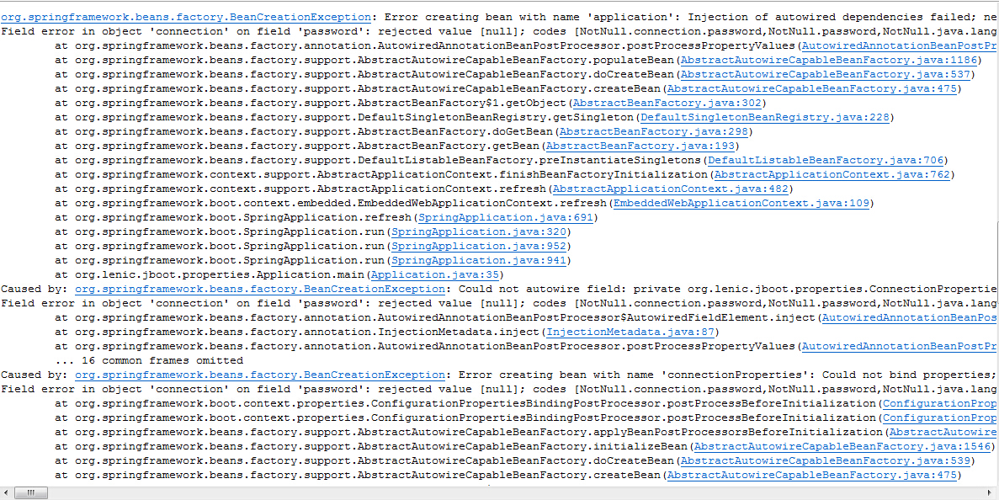

#spring-boot应用的参数设置

本文演示了如何给spring-boot应用设置参数，包括命令行、application.properties、profiles等内容。

*  spring-boot允许使用properties文件、YAML文件、命令行参数、环境变量等设置参数，不同的参数来源按以下顺序加载，并且后加载的会覆盖前面的同名参数
  1.  命令行`--app.name=myapp`
  2.  Java系统参数`System.getProperties()`
  3.  操作系统环境变量
  4.  JNDI属性`java:comp/env`
  5.  RandomValuePropertySource，随机参数只能是random.*
  6.  jar之外的application.properties或YAML
  7.  jar之内的application.properties或YAML
  8.  注解了` @Configuration`的类，可以使用使用`@PropertySource`设置为参数
  9.  通过`SpringApplication.setDefaultProperties`设置默认参数
  
*  通过命令行设置参数，以“--”开头如：--server.port=9000，可以通过`SpringApplication.setAddCommandLineProperties(false)`设置屏蔽命令行参数

```
java -jar myapplication.jar --connection.username=lenicliu --connection.passowrd=123456
```

*  使用application.properties或YAML文件设置参数，spring-boot默认会按照以下顺序查找配置文件
  1.  ./config/application.properties
  2.  ./application.properties
  3.  classpath:config/application.properties
  4.  classpath:application.properties
  
```
# 参数配置
app.name=jboot-properties-application
app.description=This is a spring-boot application in Debug-Model
connection.url=jdbc:mysql://localhost:3306/schema
connection.username=lenicliu
connection.password=123456
```
  
  *  若不想使用application.properties这样的文件名，可以通过下面两种方式加载其他文件
  
```
// 加载myproject.properties
java -jar myapplication.jar --spring.config.name=myproject
// 设置配置文件目录
java -jar myproject.jar --spring.config.location=classpath:/default.properties,classpath:/override.properties
```
  
  *  YAML和Properties

```
// YAML
app : 
  	name : myapp
  	description : this is a spring-boot app
connection : 
  	username : lenicliu
  	password : 123456

// properties
app.name=myapp
app.description=this is a spring-boot app
```
  
*  如何使用配置文件中的参数

```
# 配置文件内容
app.name=jboot-properties-application
app.description=This is a spring-boot application in Debug-Model

connection.url=jdbc:mysql://localhost:3306/schema
connection.username=lenicliu
connection.password=123456
```

```
/*
 * 配置属性类
 */
@Component
@ConfigurationProperties(prefix = "connection")
public class ConnectionProperties {

	@NotNull
	private String	username;
	
	@NotNull
	private String	password;
	
	private String	url;

	// setters and getters
}
```

```
@Autowired
private ConnectionProperties	connection;
```

*  你可能已经注意到上面的配置类中使用了`@NotNull`注解检查参数:)spring-boot默认使用JSR-303来检查参数，所以我们可以使用javax.validation.constraints中的注解来校验参数，当校验失败时会出现异常。


