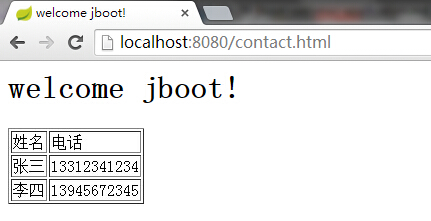

#使用spring-boot创建SpringMVC应用

本文演示了使用spring-boot构建SpringMVC应用，包括SpringMVC、异常处理、静态文件、页面模板等内容。

*  我们定义一个简单的Model类，表示通讯录里的联系人

```
public class Contact {
	private String	name;
	private String	mobile;
	
	// setters and getters
}
```

*  接着使用SpringMVC中的`@Controller`注解一个控制器，并定义一个`/contact`的URL映射

```
@Controller
public class ContactController {
	@RequestMapping("/contact")
	public @ResponseBody List<Contact> contactJSON() {
		return Arrays.asList(new Contact("张三", "13312341234"), new Contact("李四", "13945672345"));
	}
}
```

*  编写Application类作为程序启动的入口

```
@Configuration
@ComponentScan
@EnableAutoConfiguration
public class Application {
	public static void main(String[] args) {
		SpringApplication.run(Application.class, args);
	}
}
```

*  启动后访问http://localhost:8080/contact

```
[{"name":"张三","mobile":"13312341234"},{"name":"李四","mobile":"13945672345"}]
```

*  到这里一个简单的SpringMVC应用就完成。有了控制器和模型，但是还没有视图，只是一个Rest服务，下面我们使用freemarker作为视图(为什么不用JSP)，首先引入依赖

```
<dependency>
	<groupId>org.springframework.boot</groupId>
	<artifactId>spring-boot-starter-freemarker</artifactId>
</dependency>
```

*  spring-boot默认会加载classpath:/templates下的视图，所以我们在`src/main/resources`中创建`templates`目录，并添加几个文件

  *  contact.ftl	通讯录
  *  404.ftl		404错误页面
  *  error.ftl		500错误页面

*  然后在`ContactController`类里面添加一个`/contact.html`映射的方法

```
@RequestMapping("/contact.html")
public ModelAndView contactHtml() {
	List<Contact> contacts = Arrays.asList(new Contact("张三", "13312341234"), new Contact("李四","13945672345"));
	return new ModelAndView("contact", "contactList", contacts);
}
```
  
  *  contact.ftl
  
```
<html> 
	<head> 
		<title>welcome jboot!</title> 
	</head> 
	<body> 
		<h1>welcome jboot!</h1> 
		<table border="1">
			<tr>
				<td>姓名</td>
				<td>电话</td>
			</tr>
			<#list contactList as contact> 
				<tr>
					<td>${contact.name}</td>
					<td>${contact.mobile}</td>
				</tr>
			</#list> 
		</table>
	</body> 
</html> 
```
  
*  重启服务之后访问http://localhost:8080/contact.html



*  一个简单的SpringMVC应用就完成了，下面我们再来做一些改造
  *  支持自定义404和500错误
  *  支持静态文件

*  在Application中定义一个static类实现`EmbeddedServletContainerCustomizer`接口来扩展Servlet容器:添加一个404错误页面和500错误页面

```
private static class CustomizedContainer implements EmbeddedServletContainerCustomizer {
	@Override
	public void customize(ConfigurableEmbeddedServletContainer container) {
		container.addErrorPages(new ErrorPage(HttpStatus.NOT_FOUND, "/404.ftl"));
		container.addErrorPages(new ErrorPage(HttpStatus.INTERNAL_SERVER_ERROR, "/error.ftl"));
	}
}
```

  *  404.ftl
  
```
<html> 
	<head> 
		<title>welcome jboot!</title> 
	</head> 
	<body> 
		<p>Hi,Not found</p> 
	</body> 
</html> 
```

  *  error.ftl

```
<html> 
	<head> 
		<title>welcome jboot!</title> 
	</head> 
	<body> 
		<p>oh, no, server error! </p> 
	</body> 
</html> 
```

*  添加一个ErrorController类，其中404方法是自定义的跳转页面，500方法是演示出现异常会返回error.ftl

```
@Controller
public class ErrorController {
	@RequestMapping("/404.ftl")
	public String _404() {
		return "404";
	}
	@RequestMapping("/error500")
	public String _500() throws Exception {
		throw new Exception();
	}
}
```

*  重启服务后，我们随便访问一个不存在的地址http://localhost:8080/asdfwsxcde


*  再访问那个会抛出异常的地址http://localhost:8080/error500


*  那么`EmbeddedServletContainerCustomizer`还有那些方法呢？

```
container.addErrorPages(errorPages);//添加错误页面
container.addInitializers(initializers);//添加初始化器
container.setAddress(address);//绑定地址
container.setContextPath(contextPath);//设置上下文路径
container.setDocumentRoot(documentRoot);//设置文档目录
container.setPort(port);//设置端口
container.setSessionTimeout(sessionTimeout);//设置会话超时
```

*  最后，spring-boot也支持静态文件，以下目录中的文件会被认为是静态文件

  *  classpath:/META-INF/resources
  *  classpath:/public
  *  classpath:/resources
  *  classpath:/static

*  比如在`src/main/resources`中添加/static/static.txt，内容如下

```
static.txt in classpath:/static
```

*  访问http://localhost:8080/static.txt


*  OK，知道了M-V-C和静态资源的使用，下一篇我们将着重分享[<在spring-boot中如何支持多种视图和数据的输出>](2014-10-28-jboot-multiviews-application.md)