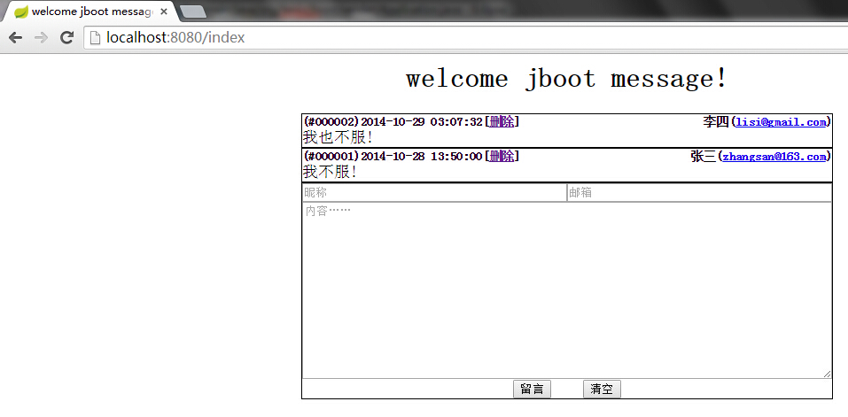
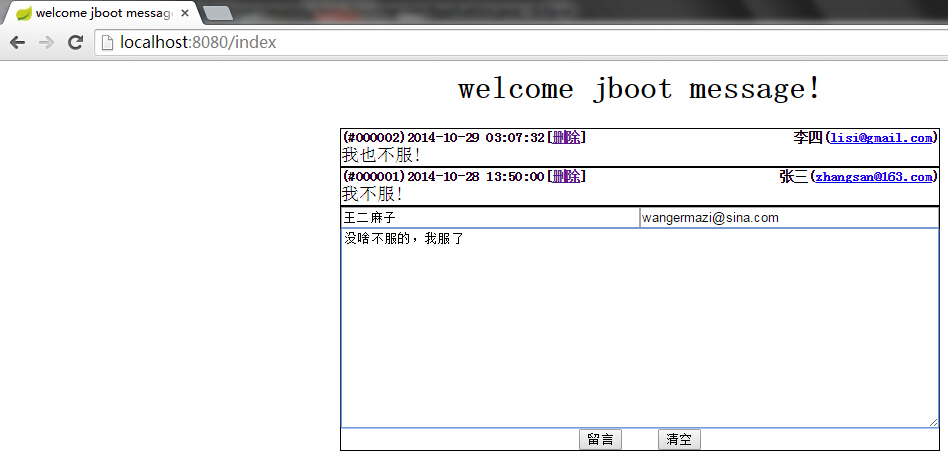
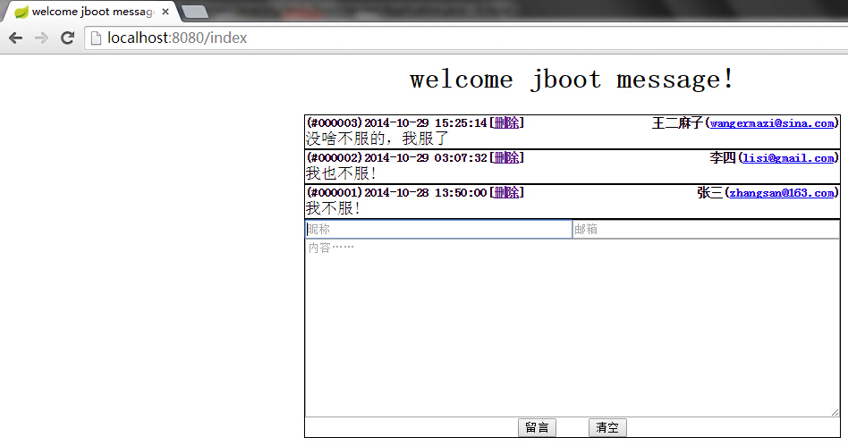

#在spring-boot使用jdbc访问数据库

本文通过一个留言板程序演示了在spring-boot应用jdbc访问数据库

*  首先在`application.properties`中定义jdbc属性

```
spring.datasource.driverClassName=org.h2.Driver
spring.datasource.url=jdbc:h2:mem:jboot
spring.datasource.username=sa
spring.datasource.password=sa
spring.datasource.max-active=100
spring.datasource.max-idle=8
spring.datasource.min-idle=8
spring.datasource.initial-size=10
spring.datasource.validation-query=SELECT 1
spring.datasource.test-on-borrow=false
spring.datasource.test-on-return=false
```

*  这里使用[h2database](http://www.h2database.com/)作为数据库，通过`jdbc:h2:mem:jboot`启动内存模式，接着配置数据库初始化参数

```
spring.datasource.name=dataSource
spring.datasource.initialize=true
spring.datasource.schema=classpath:/sql/schema.sql
spring.datasource.data=classpath:/sql/data.sql
spring.datasource.sqlScriptEncoding=UTF-8
spring.datasource.continueOnError=false
spring.datasource.separator=;
```

*  在`src/main/resources`中添加`/sql/schema.sql`和`/sql/data.sql`两个脚本，分别用来建表和插入初始数据

```
CREATE TABLE MESSAGE(
	ID CHAR(6) PRIMARY KEY,
	AUTHOR VARCHAR(20) NOT NULL,
	EMAIL VARCHAR(20),
	CONTENT VARCHAR(2000),
	CREATED DATETIME
);
```

```
INSERT INTO MESSAGE(ID,AUTHOR,EMAIL,CONTENT,CREATED)VALUES('000001','张三','zhangsan@163.com','我不服!','2014-10-28 13:50:00');
INSERT INTO MESSAGE(ID,AUTHOR,EMAIL,CONTENT,CREATED)VALUES('000002','李四','lisi@gmail.com','我也不服!','2014-10-29 03:07:32');
```

*  引入依赖

```
<dependency>
	<groupId>org.springframework.boot</groupId>
	<artifactId>spring-boot-starter-jdbc</artifactId>
</dependency>
<dependency>
	<groupId>com.h2database</groupId>
	<artifactId>h2</artifactId>
</dependency>
```

*  注入JdbcTemplate

```
@Autowired
private JdbcTemplate	jdbcTemplate;
```

*  定义实体类Message

```
public static class Message {
	private String	id;
	private String	author;
	private String	email;
	private String	content;
	private Date	created;
	// setters and getters 
}
```

*  编写留言展示、提交留言、删除留言的请求处理

```
@RequestMapping("/index")
public ModelAndView index() {
	// 业务逻辑-略
	return new ModelAndView("index", "messages", messages);
}
@RequestMapping(value = "/delete", method = RequestMethod.GET)
public String delete(Message message) {
	// 业务逻辑-略
	return "redirect:index";
}
@RequestMapping(value = "/submit", method = RequestMethod.POST)
public String submit(Message message) {
	// 业务逻辑-略 
	return "redirect:index";
}
```

*  添加freemarker配置

```
spring.freemarker.allowRequestOverride=false
spring.freemarker.cache=true
spring.freemarker.checkTemplateLocation=true
spring.freemarker.charSet=UTF-8
spring.freemarker.contentType=text/html
spring.freemarker.exposeRequestAttributes=false
spring.freemarker.exposeSessionAttributes=false
spring.freemarker.exposeSpringMacroHelpers=false
spring.freemarker.requestContextAttribute=request
spring.freemarker.suffix=.ftl
spring.freemarker.templateLoaderPath=classpath:/templates/
```

*  在`src/main/resources`中添加`/templates/index.ftl`页面

```
<html> 
	<head> 
		<title>welcome jboot message!</title>
		<style type="text/css">
			样式
		</style>
	</head> 
	<body style="text-align:center;">
		<h1>welcome jboot message!</h1>
		<#list messages as message>
			留言列表
		</#list>
		<form action="${request.contextPath}/submit" method="post">
			表单
		</form>
		<script type="text/javascript">
			//脚本
		</script>
	</body>
</html>
```

*  启动访问`http://localhost:8080/index`，添加留言表单提交！oh，No，是不是乱码了？对，我们还需要添加一个编码过滤器

```
@Bean(name = "characterEncodingFilter")
public FilterRegistrationBean characterEncodingFilter() {
	FilterRegistrationBean bean = new FilterRegistrationBean();
	bean.addInitParameter("encoding", "UTF-8");
	bean.addInitParameter("forceEncoding", "true");
	bean.setFilter(new CharacterEncodingFilter());
	bean.addUrlPatterns("/*");
	return bean;
}
```

*  重启，这下OK了，主要还是jdbc的配置，是不是方便很多？这也就是spring-boot的优势，看看效果吧




