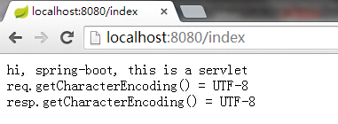

#在spring-boot中使用servlet和filter

本文演示了在spring-boot应用中使用servlet和filter。

*  定义一个IndexServlet类

```
	public static class IndexServlet extends HttpServlet {
		private static final long	serialVersionUID	= -8944347685885474860L;
		@Override
		protected void doGet(HttpServletRequest req, HttpServletResponse resp) throws ServletException, IOException {
			doPost(req, resp);
		}
		@Override
		protected void doPost(HttpServletRequest req, HttpServletResponse resp) throws ServletException, IOException {
			resp.setContentType("text/html");
			resp.getWriter().write("hi, spring-boot, this is a servlet<br/>");
			resp.getWriter().write("req.getCharacterEncoding() = " + req.getCharacterEncoding() + "<br/>");
			resp.getWriter().write("resp.getCharacterEncoding() = " + resp.getCharacterEncoding() + "<br/>");
			resp.getWriter().flush();
		}
	}
```

*  定义`ServletRegistrationBean`和`FilterRegistrationBean`注入bean

```
@Bean(name = "characterEncodingFilter")
public FilterRegistrationBean characterEncodingFilter() {
	FilterRegistrationBean bean = new FilterRegistrationBean();
	bean.addInitParameter("encoding", "UTF-8");
	bean.addInitParameter("forceEncoding", "true");
	bean.setFilter(new CharacterEncodingFilter());
	bean.addUrlPatterns("/*");
	return bean;
}
@Bean(name = "indexServlet")
public ServletRegistrationBean indexServlet() {
	ServletRegistrationBean bean = new ServletRegistrationBean();
	bean.setServlet(new IndexServlet());
	bean.addUrlMappings("/index");
	return bean;
}
```

*  启动后访问http://localhost:8080/index


