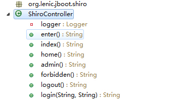
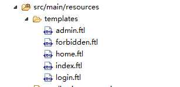
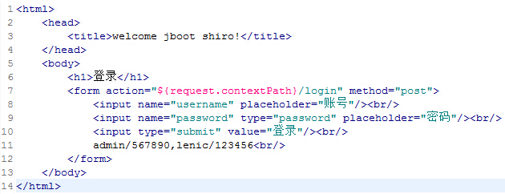

#使用Apache Shiro保护spring-boot应用

在spring-boot官方提供的demo中，使用了spring security保护应用，在这里我们用Apache Shiro当保镖:)

*  引入Shiro的依赖

```
<dependency>
	<groupId>org.apache.shiro</groupId>
	<artifactId>shiro-web</artifactId>
	<version>1.2.3</version>
</dependency>
<dependency>
	<groupId>org.apache.shiro</groupId>
	<artifactId>shiro-spring</artifactId>
	<version>1.2.3</version>
</dependency>
```

*  首先我们来看Shiro和Spring如何集成使用
*  web.xml

```
<!-- The filter-name matches name of a 'shiroFilter' bean inside applicationContext.xml -->
<filter>
    <filter-name>shiroFilter</filter-name>
    <filter-class>org.springframework.web.filter.DelegatingFilterProxy</filter-class>
    <init-param>
        <param-name>targetFilterLifecycle</param-name>
        <param-value>true</param-value>
    </init-param>
</filter>

...

<!-- Make sure any request you want accessible to Shiro is filtered. /* catches all -->
<!-- requests.  Usually this filter mapping is defined first (before all others) to -->
<!-- ensure that Shiro works in subsequent filters in the filter chain:             -->
<filter-mapping>
    <filter-name>shiroFilter</filter-name>
    <url-pattern>/*</url-pattern>
</filter-mapping>
```

*  applicationContext.xml

```
<bean id="shiroFilter" class="org.apache.shiro.spring.web.ShiroFilterFactoryBean">
    <property name="securityManager" ref="securityManager"/>
    <!-- override these for application-specific URLs if you like:
    <property name="loginUrl" value="/login.jsp"/>
    <property name="successUrl" value="/home.jsp"/>
    <property name="unauthorizedUrl" value="/unauthorized.jsp"/> -->
    <!-- The 'filters' property is not necessary since any declared javax.servlet.Filter bean  -->
    <!-- defined will be automatically acquired and available via its beanName in chain        -->
    <!-- definitions, but you can perform instance overrides or name aliases here if you like: -->
    <!-- <property name="filters">
        <util:map>
            <entry key="anAlias" value-ref="someFilter"/>
        </util:map>
    </property> -->
    <property name="filterChainDefinitions">
        <value>
            # some example chain definitions:
            /admin/** = authc, roles[admin]
            /docs/** = authc, perms[document:read]
            /** = authc
            # more URL-to-FilterChain definitions here
        </value>
    </property>
</bean>

<!-- Define any javax.servlet.Filter beans you want anywhere in this application context.   -->
<!-- They will automatically be acquired by the 'shiroFilter' bean above and made available -->
<!-- to the 'filterChainDefinitions' property.  Or you can manually/explicitly add them     -->
<!-- to the shiroFilter's 'filters' Map if desired. See its JavaDoc for more details.       -->
<bean id="someFilter" class="..."/>
<bean id="anotherFilter" class="..."> ... </bean>
...

<bean id="securityManager" class="org.apache.shiro.web.mgt.DefaultWebSecurityManager">
    <!-- Single realm app.  If you have multiple realms, use the 'realms' property instead. -->
    <property name="realm" ref="myRealm"/>
    <!-- By default the servlet container sessions will be used.  Uncomment this line
         to use shiro's native sessions (see the JavaDoc for more): -->
    <!-- <property name="sessionMode" value="native"/> -->
</bean>
<bean id="lifecycleBeanPostProcessor" class="org.apache.shiro.spring.LifecycleBeanPostProcessor"/>

<!-- Define the Shiro Realm implementation you want to use to connect to your back-end -->
<!-- security datasource: -->
<bean id="myRealm" class="...">
...
</bean>
```

*  在spring-boot中我们使用AutoConfiguration方式

```
@Bean(name = "shiroFilter")
public ShiroFilterFactoryBean shiroFilter() {
	ShiroFilterFactoryBean shiroFilter = new ShiroFilterFactoryBean();
	shiroFilter.setLoginUrl("/login");
	shiroFilter.setSuccessUrl("/index");
	shiroFilter.setUnauthorizedUrl("/forbidden");
	Map<String, String> filterChainDefinitionMapping = new HashMap<String, String>();
	filterChainDefinitionMapping.put("/", "anon");
	filterChainDefinitionMapping.put("/home", "authc,roles[guest]");
	filterChainDefinitionMapping.put("/admin", "authc,roles[admin]");
	shiroFilter.setFilterChainDefinitionMap(filterChainDefinitionMapping);
	shiroFilter.setSecurityManager(securityManager());
	Map<String, Filter> filters = new HashMap<String, Filter>();
	filters.put("anon", new AnonymousFilter());
	filters.put("authc", new FormAuthenticationFilter());
	filters.put("logout", new LogoutFilter());
	filters.put("roles", new RolesAuthorizationFilter());
	filters.put("user", new UserFilter());
	shiroFilter.setFilters(filters);
	System.out.println(shiroFilter.getFilters().size());
	return shiroFilter;
}

@Bean(name = "securityManager")
public SecurityManager securityManager() {
	DefaultWebSecurityManager securityManager = new DefaultWebSecurityManager();
	securityManager.setRealm(realm());
	return securityManager;
}

@Bean(name = "realm")
@DependsOn("lifecycleBeanPostProcessor")
public PropertiesRealm realm() {
	PropertiesRealm propertiesRealm = new PropertiesRealm();
	propertiesRealm.init();
	return propertiesRealm;
}

@Bean
public LifecycleBeanPostProcessor lifecycleBeanPostProcessor() {
	return new LifecycleBeanPostProcessor();
}
```

*  我们使用了Shiro的`PropertiesRealm`作为认证和授权管理器，所以添加`classpath:/shiro-users.properties`，格式为`user.username = password,role1,role1,...`

```
user.admin = 567890,admin,guest
user.lenic = 123456,guest
```

*  添加一些Controller和ftl文件




